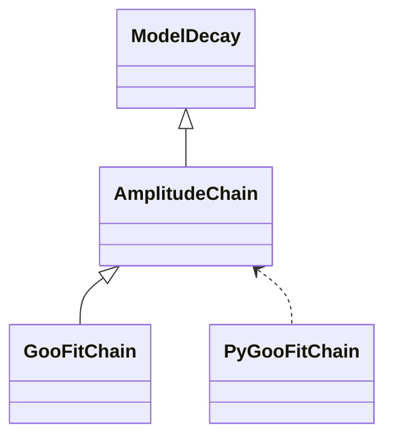

# DecayLanguage & AmpGen

---

# AmpGen

- Fitting and generating multi-body particle decays with an isobar model
- Dynamically generates source code that can be compiled and used
- Support for SIMD in 2.0
- Has a custom DSL for specifying decays

<br/>

<div align="center">
  
</div>

---

# The AmpGen Syntax

<div/>

There are some global options, like the event type:


```text
EventType D0 K+ pi- pi- pi+
```

<div v-click>

Then there are a series of amplitudes:

```text{3}
#                                           Real / Amplitude   | Imaginary / Phase
#                                           Fix?  Value  Step  | Fix?  Value  Step
D0{K*(892)0{K+,pi-},rho(770)0{pi+,pi-}}     2     1      0       2     0      0
```

</div>
<div v-click>

This is a decay product, using curly braces:

```text
K*(892)0{K+,pi-}
```

</div>

<div v-click>

You can specify a decay in multiple steps:

```text
D0{K(1)(1270)+,pi-}                         0     1      0.1       0     0      0.1   

K(1)(1270)+{rho(770)0{pi+,pi-},K+}          2     1      0         2     0      0
K(1)(1270)+{K*(892)0{K+,pi-},pi+}           0     1      0.1       0     0      0.1
```

</div>

---

# DecayLanguage (the package)

- Initially designed to convert the AmpGen syntax to GooFit C++ code
- Later decfile parsing was added to the package
- And then tests were disabled for AmpGen parser feature and has fallen into disrepair...

<br/>
<div align="center">
  
</div>

---

# DecayLanguage -> GooFit
Input file

```text
EventType D0 K- pi+ pi+ pi-

a(1)(1260)+::Spline::Min 0.18412
a(1)(1260)+::Spline::Max 1.9
a(1)(1260)+::Spline::N 40
```
...
```text
D0[D]{K*(892)bar0{K-,pi+},rho(770)0{pi+,pi-}}              2 1         0          2 0         0
D0[D]{rho(1450)0{pi+,pi-},K*(892)bar0{K-,pi+}}             0 0.648936  0.0205762  0 -0.271637 0.0342107
D0[P]{K*(892)bar0{K-,pi+},rho(770)0{pi+,pi-}}              0 0.362058  0.00237314 0 -1.79607  0.00663691
D0[P]{rho(1450)0{pi+,pi-},K*(892)bar0{K-,pi+}}             0 0.642781  0.00570074 0 1.69828   0.00900026
D0{K(1)(1270)bar-,pi+}                                     0 0.361958  0.00377983 0 1.99329   0.0132565
D0{K(1)(1400)bar-{K*(892)bar0{K-,pi+},pi-},pi+}            0 0.127477  0.00221089 0 -2.96395  0.0192276
```
...
```text
D0_radius                                         2              0.0037559      0
IS_p1_4pi                                         2              0              0
IS_p1_EtaEta                                      2              -0.39899       0
IS_p1_EtapEta                                     2              -0.34639       0
```

---

# DecayLanguage -> GooFit
Autogenerated - heading

```text
/* Autogenerated file by AmpGen2GooFit
Generated on  2018-08-08 09:14:13.337182


DtoV1S2_V1toP1P2_S2toP3P4 : SF_4Body.DtoVS_VtoP1P2_StoP3P4 SF_4Body.FF_12_34_L1
  D0{K(892)~0{K-,pi+},PiPi10[kMatrix.pole.1]{pi+,pi-}}
  D0{K(892)~0{K-,pi+},PiPi10[kMatrix.prod.0]{pi+,pi-}}
  D0{rho(770)0{pi+,pi-},KPi10[FOCUS.I32]{K-,pi+}}
  D0{rho(770)0{pi+,pi-},KPi10[FOCUS.Kpi]{K-,pi+}}
```
...

```text
      Scalar: PiPi00      PiPi10      PiPi20      PiPi30      KPi00       KPi10       KPi20
PseudoScalar: pi+         pi-         K-          D0          K(1460)~-
      Vector: rho(770)0   omega(782)0 K(892)~0    rho(1450)0
       Axial: K(1)(1270)~- a(1)(1260)+ K(1)(1400)~-
      Tensor: K(2)~-
PseudoTensor:
     Unknown:
```

---

# DecayLanguage -> GooFit
Autogenerated - heading (cont.)

```text
 0 D0[D]{K(892)~0{K-,pi+},rho(770)0{pi+,pi-}}                             spinfactors: 2  L: 2 [0-2]
 1 D0[D]{rho(1450)0{pi+,pi-},K(892)~0{K-,pi+}}                            spinfactors: 2  L: 2 [0-2]
 2 D0[P]{K(892)~0{K-,pi+},rho(770)0{pi+,pi-}}                             spinfactors: 2  L: 1 [0-2]
```

...

```text
All discovered spin configurations:
DtoA1P1_A1toS2P2_S2toP3P4
DtoA1P1_A1toV2P2Dwave_V2toP3P4
DtoA1P1_A1toV2P2_V2toP3P4
DtoS1S2_S1toP1P2_S2toP3P4
DtoT1P1_T1toV2P2_V2toP3P4
DtoV1S2_V1toP1P2_S2toP3P4
DtoV1V2_V1toP1P2_V2toP3P4
DtoV1V2_V1toP1P2_V2toP3P4_D
DtoV1V2_V1toP1P2_V2toP3P4_P
Dtos1P1_s1toS2P2_S2toP3P4
Dtos1P1_s1toV2P2_V2toP3P4
```

---

# DecayLanguage -> GooFit
Autogenerated - code

```cpp
    // Intro
    // Event type: D0 ->  K- (0)   pi+ (1)   pi+ (2)   pi- (3)

    std::vector<std::vector<Lineshape*>> line_factor_list;
    std::vector<std::vector<SpinFactor*>> spin_factor_list;
    std::vector<Amplitude*> amplitudes_list;

    constexpr fptype PI_P     { 0.13957018     };
    constexpr fptype PI_M     { 0.13957018     };
    constexpr fptype D_0      { 1.86484        };
    constexpr fptype K_M      { 0.493677       };

    Variable K892_0_M        { "K892_0_M"           , 0.896      };
    Variable K892_0_W        { "K892_0_W"           , 0.0503     };
```

...

```cpp
    DK3P_DI.meson_radius = 5;
    DK3P_DI.particle_masses = {D_0, K_M, PI_P, PI_P, PI_M};
```

---

# DecayLanguage -> GooFit
Autogenerated - code (cont.)

```cpp
    std::array<Variable, 5> f_scatt {{
        f_scatt0,
        f_scatt1,
        f_scatt2,
        f_scatt3,
        f_scatt4
    }};
```


---

# DecayLanguage -> GooFit
Autogenerated - code (cont. 2)

```cpp
    // Line 1
    // D0[D]{rho(1450)0{pi+,pi-},K(892)~0{K-,pi+}}
    spin_factor_list.push_back(std::vector<SpinFactor*>({
        new SpinFactor("SF", SF_4Body::DtoV1V2_V1toP1P2_V2toP3P4_D          , 1, 3, 0, 2),
        new SpinFactor("SF", SF_4Body::FF_12_34_L2                          , 1, 3, 0, 2),
        new SpinFactor("SF", SF_4Body::DtoV1V2_V1toP1P2_V2toP3P4_D          , 2, 3, 0, 1),
        new SpinFactor("SF", SF_4Body::FF_12_34_L2                          , 2, 3, 0, 1)
    }));
    line_factor_list.push_back(std::vector<Lineshape*>{
        new Lineshapes::RBW("rho(1450)0", rho1450_0_M, rho1450_0_W, 1, M_24, FF::BL2),
        new Lineshapes::RBW("K*(892)bar0", K892_0_M, K892_0_W, 1, M_24, FF::BL2),
        new Lineshapes::RBW("rho(1450)0", rho1450_0_M, rho1450_0_W, 1, M_34, FF::BL2),
        new Lineshapes::RBW("K*(892)bar0", K892_0_M, K892_0_W, 1, M_34, FF::BL2)
    });
    amplitudes_list.push_back(new Amplitude{
        "D0[D]{rho(1450)0{pi+,pi-},K(892)~0{K-,pi+}}",
        mkvar("D0[D]{rho(1450)0{pi+,pi-},K(892)~0{K-,pi+}}_r", false, 0.625141, 0.042018),
        mkvar("D0[D]{rho(1450)0{pi+,pi-},K(892)~0{K-,pi+}}_i", false, -0.174115, 0.643036),
        line_factor_list.back(),
        spin_factor_list.back(),
        2});
    DK3P_DI.amplitudes_B.push_back(amplitudes_list.back());
```

---

# DecayLanguage -> GooFit
Plans

- Restore operation (changes in Particle, AmpGen uses 2008 datafile)
- Reenable tests
- Run on several models

---

# DecayLanguage -> Other things
Some ideas

There's really no reason it can't also produce GooFit Python code, or any other framework, as long as the decay shapes are implemented.


